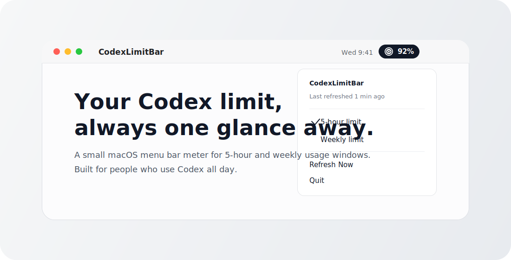

# CodexLimitBar

[](https://github.com/parkjaeuk0210/CodexLimitBar/releases/latest)
[](#requirements)
[](LICENSE)

Keep your Codex limit in the macOS menu bar.

CodexLimitBar is for the moment when you are deep in a session and just want to
know one thing: how much room is left? It shows a compact menu bar meter for
your Codex usage, refreshes quietly in the background, and lets you switch
between the 5-hour and weekly limit windows.



No browser tab. No manual `/status` check. No private token scraping.

## What It Shows

- Remaining Codex usage as a compact menu bar percentage.
- Either the 5-hour window or the weekly window.
- The installed Codex or ChatGPT app icon when macOS can find one.
- Last refresh time and current refresh cadence in the menu.

## Install

### Homebrew

```sh
brew tap parkjaeuk0210/codexlimitbar
brew install --cask codexlimitbar
```

### Manual Download

Grab the latest build from [Releases](https://github.com/parkjaeuk0210/CodexLimitBar/releases/latest):

```text
CodexLimitBar-<version>-unsigned.zip
```

Unzip it, move `CodexLimitBar.app` to `/Applications`, then launch it.

This early build is unsigned and not notarized yet. On first launch, macOS may
show a security warning. Control-click the app, choose **Open**, then confirm.

## Requirements

- macOS 13 or newer
- Codex CLI installed and available as `codex`
- A logged-in Codex CLI session (`codex login`)

You do not need the Codex desktop app. If Codex or ChatGPT is installed,
CodexLimitBar borrows that local app icon for the menu bar. If not, it still
works with the Codex CLI and falls back to a system icon.

## Battery And Privacy

CodexLimitBar is intentionally quiet:

- It refreshes every 15 minutes on power adapter.
- It refreshes every 10 minutes on battery.
- It refreshes every 30 minutes in Low Power Mode.
- It starts a short-lived local Codex app-server only while refreshing.
- It does not read `~/.codex/auth.json` directly.
- It stores only the latest cached usage snapshot in
  `~/Library/Application Support/CodexLimitBar`.

In normal use, the app should spend almost all of its time idle.

## Build From Source

```sh
./scripts/build.sh
open .build/CodexLimitBar.app
```

## Check

```sh
./scripts/check.sh
```

## Package

```sh
./scripts/package.sh
```

The package script creates:

```text
dist/CodexLimitBar-<version>-unsigned.zip
dist/CodexLimitBar-<version>-unsigned.zip.sha256
```

For Developer ID signing and notarized public releases, see
[docs/notarization.md](docs/notarization.md).

## How It Works

```text
Menu timer or Refresh Now
-> CodexRateLimitClient
-> short-lived `codex app-server --listen ws://127.0.0.1:<port>`
-> /readyz
-> WebSocket JSON-RPC initialize
-> account/rateLimits/read
-> cache JSON
-> NSStatusItem menu title
```

The important part: CodexLimitBar asks the local Codex CLI for the same account
limit data instead of reading credential files itself.

## Current Limitations

- macOS only.
- Requires the Codex CLI to be installed and logged in.
- Current releases are unsigned and not notarized.
- The Codex app-server protocol is local and not a formally documented public
  API. If it changes, the app will show an error instead of touching private
  credentials.

## Roadmap

- Signed and notarized releases.
- Signed and notarized Homebrew Cask releases.
- A shorter first-run flow for unsigned builds.
- Optional threshold color or notification settings.

## Source Layout

```text
Sources/CodexLimitBar/Models.swift                 Codable response models
Sources/CodexLimitBar/CodexRateLimitClient.swift   local Codex app-server RPC
Sources/CodexLimitBar/PowerState.swift             battery-aware refresh cadence
Sources/CodexLimitBar/MenuBarPreferences.swift     saved display settings
Sources/CodexLimitBar/MenuBarTitleFormatter.swift  menu bar label formatting
Sources/CodexLimitBar/AppDelegate.swift            macOS menu and app lifecycle
Sources/CodexLimitBar/main.swift                   app entrypoint
```

## Trademark

CodexLimitBar is not affiliated with OpenAI. Codex and ChatGPT are trademarks of
OpenAI. The app uses installed local app icons when available and does not
bundle OpenAI logo assets.
